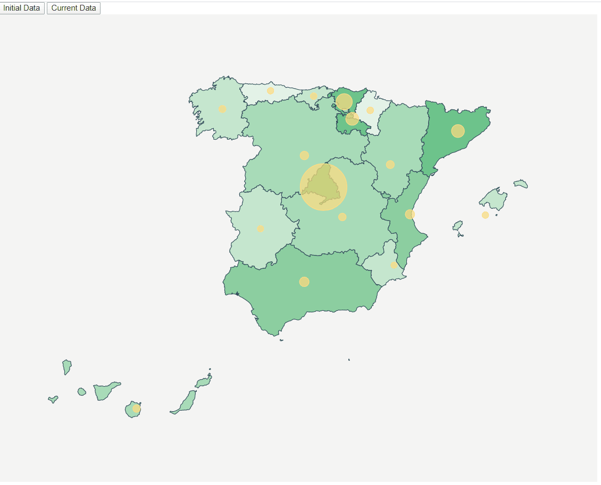

## Pinning locations + scale (Spain Map) + 
## Update MapView (2 source data) + ColorChanges

Taking as starting point our d3js-mandatory task, now we want to include different colors for 
each region according with our circles size.

Something like this:




We have to face three topics here:

- Change the color of the regions depending of the infected number


### First Step

- Using the base our mandatory task:

    * Take as starting example https://github.com/rubennatru/d3js-mandatory , 
    let's copy the content from that folder and execute _npm install_.

        ```bash
          npm install
        ```
  

### Second Step

  - Delete the fill attr from our css file:
    
    
    
        
          .country {
              stroke-width: 1;
              stroke: #2f4858;
          }
     
   
 ## Third Step  
 
 -  Select your color group:
 
 
            var color = d3
                .scaleThreshold<number, string>()
                .domain([5, 20, 50, 100, 500, 2000, 3000])
                .range([
                        "#e3f3e7",
                        "#c6e7cf",
                        "#a9dbb8",
                        "#8ccfa1",
                        "#6dc38b",
                        "#49b675",
                        "#3f9561"
                      ]);
 
 
 
  - Draw your map and select the color depending on the infected:
  
            const assignRegionBackgroundColor = (name: string) => {
              const item = data.find(
                item => item.name === name
              );

              if (item) {
                console.log(item.value);
              }
              return item ? color(item.value) : color(0);
            };
   

            svg
              .selectAll("path")
              .data(geojson["features"])
              .enter()
              .append("path")
              .attr("class", "country")
              .attr("fill", d => assignRegionBackgroundColor(d["properties"]["NAME_1"]))
              .attr("d", geoPath as any)
              .merge(svg.selectAll("path") as any)
              .transition()
              .duration(500)
              .attr("fill", d => assignRegionBackgroundColor(d["properties"]["NAME_1"]));


Now, We have the map working fine!!
